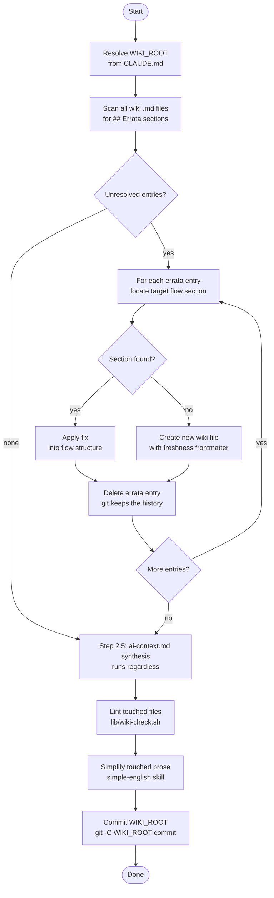

# wiki-maintenance

> Incorporates unresolved errata entries from ticket-appraise and ticket-implement feedback into wiki flow files. Reads all Errata sections, applies gap fixes to the relevant flow sections, deletes each entry once incorporated (git is the audit trail), simplifies touched prose with the simple-english skill, lints the result, and commits WIKI_ROOT.

## What it does

`wiki-maintenance` keeps the project's call-chain wiki files accurate by processing the errata backlog accumulated during ticket work. When `/ticket-appraise` or `/ticket-implement` discovers that a wiki flow section is wrong or incomplete, it appends an errata entry to that flow file rather than modifying it mid-run — appraise closes the loop immediately at discovery time, implement closes it whenever a consulted wiki fact turns out wrong or missing, independent of whether the ticket's outcome matched its predicted complexity. `wiki-maintenance` collects all unresolved errata, applies the fixes directly into the existing flow structure (tagged `(TICKET-ID)` for provenance, not appended as a changelog), and **deletes** each entry once its fix lands — git history is the audit trail, so the wiki file itself only ever shows gaps still open. It then lints every touched file against the freshness contract (`lib/wiki-check.sh`), runs the `simple-english` skill over the descriptive prose it just wrote or edited (code, identifiers, paths, and provenance tags are exempt), and commits `WIKI_ROOT`, which is its own docs repo with no branches. Run when 5+ unresolved errata entries have accumulated, or on a scheduled basis.

## Trigger

**Slash command:** `/wiki-maintenance`

**Natural language:** "maintain wiki", "update wiki from errata", "incorporate errata", "fix wiki gaps"

## Inputs

| Input | Source | Required |
|-------|--------|----------|
| Errata entries | `WIKI_ROOT/**/*.md` (`## Errata` sections) | Yes |
| `WIKI_ROOT` | CLAUDE.md field | Yes |
| `$LOG_FILE` / `$HB_LOG_FILE` | Environment (set by ticket-auto) | No (only in pipeline context) |

## Outputs / Artifacts

| Artifact | Location | Description |
|----------|----------|-------------|
| Updated wiki flow files | `WIKI_ROOT/` | Errata gaps incorporated directly into existing flow sections, tagged `(TICKET-ID)` |
| Deleted errata entries | Same wiki files | Incorporated `## Errata` entries removed (not struck through) — git history is the record |
| New wiki files | `WIKI_ROOT/` | Created if an errata entry references a new flow area; carries the freshness frontmatter (`verified_at`, `verified_against`, `stale_after`, `verified`) |
| Lint report | stdout / pipeline log | `lib/wiki-check.sh` findings for every file this run touched |
| Simplified prose | `WIKI_ROOT/` | Descriptive/procedural text this run wrote or edited, rewritten in Plain mode via the `simple-english` skill before commit |
| `WIKI_ROOT` commit | `WIKI_ROOT`'s own git history | `docs(wiki): <TICKET-ID> 
` — the one commit `ticket-maintenance-agent` is permitted to make |

## How it works

## Related skills

- [`/ticket-appraise`](ticket-appraise.md) — closes the loop immediately at discovery time (Step 3c) when a wiki fact proves stale
- [`/ticket-implement`](ticket-implement.md) — appends errata entries whenever a consulted wiki fact turns out wrong or missing (Step 4c Part 3), independent of complexity mismatch
- [`/ticket-retro`](ticket-retro.md) — the consumer for `source=appraise` complexity-calibration corrections, which this skill deliberately does NOT promote to the wiki
- [`/ticket-auto`](ticket-auto.md) — can invoke this as a maintenance phase step
